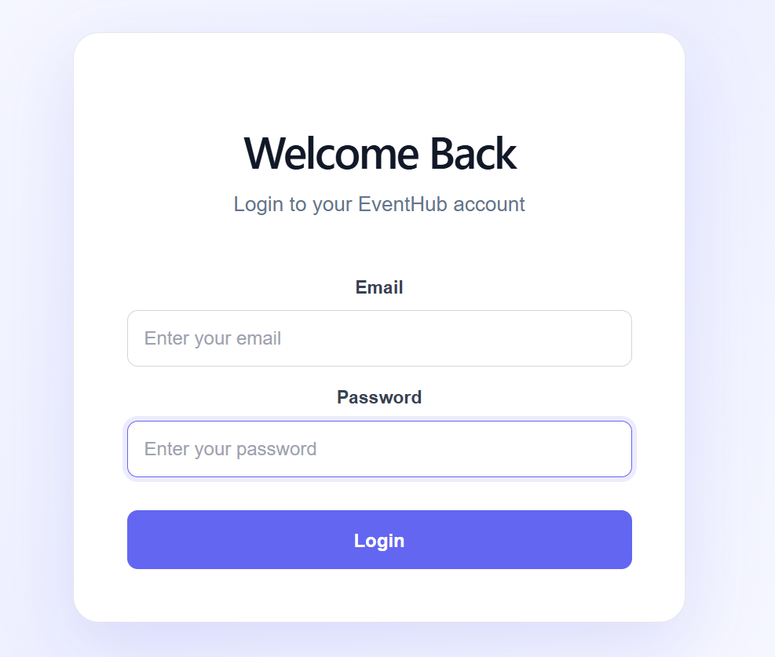
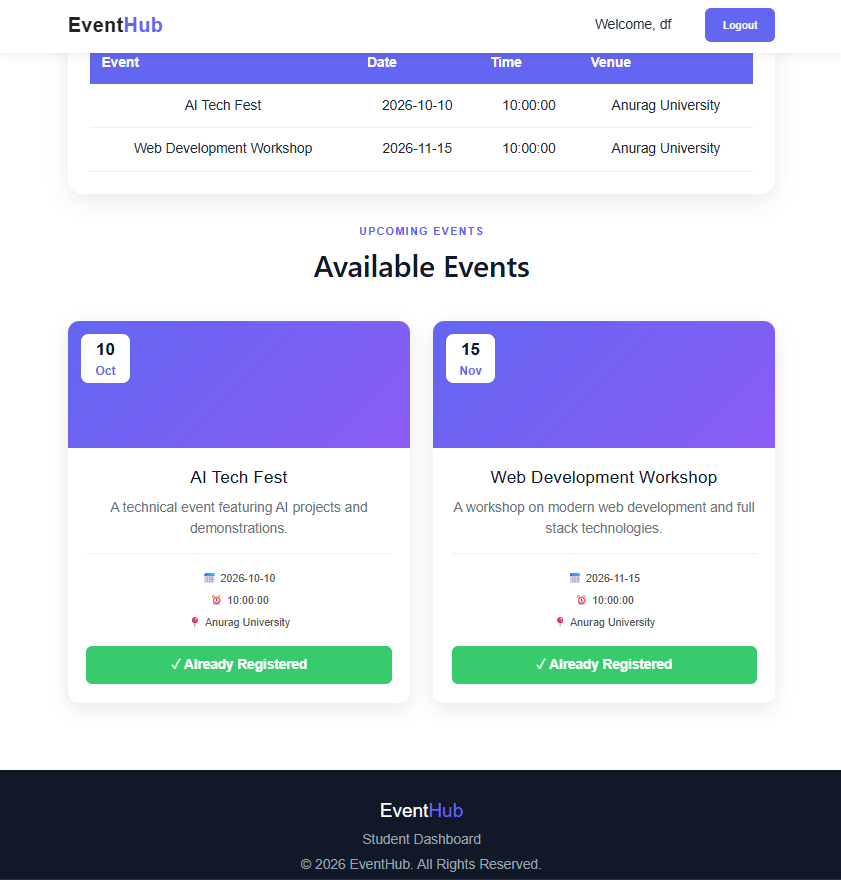
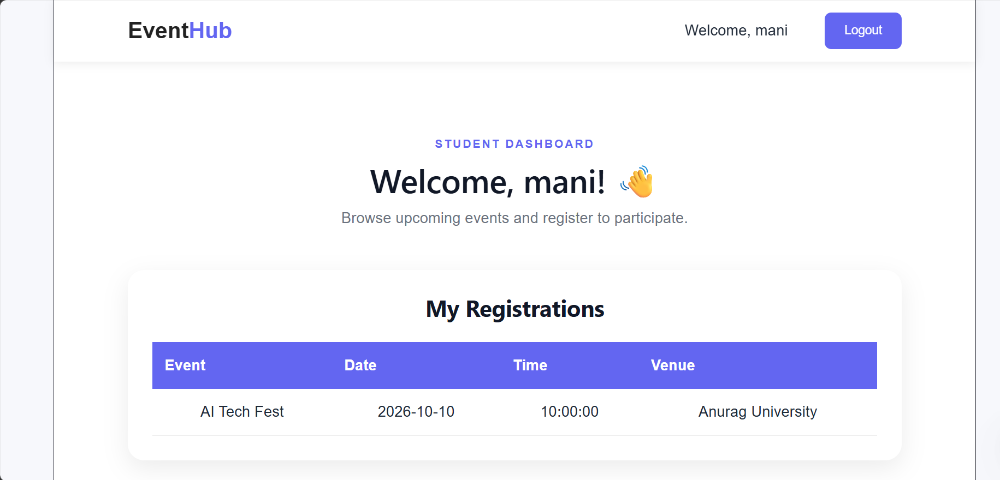
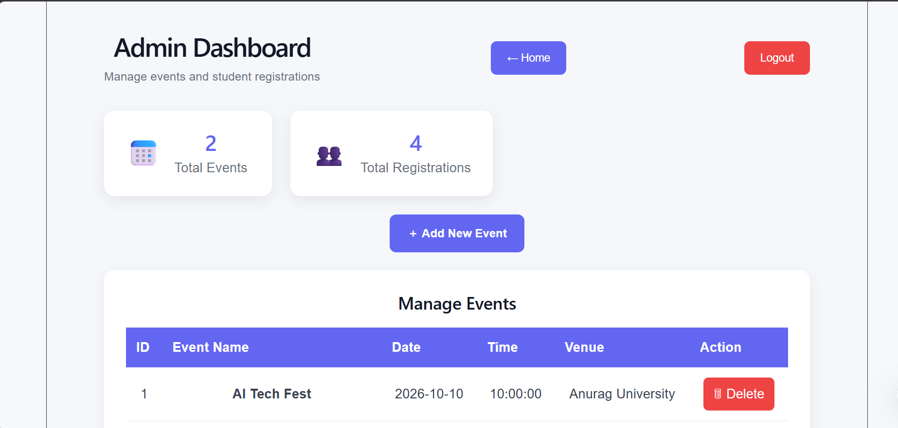

# EventHub – Full Stack Event Management System

EventHub is a full-stack web application designed to manage college events, student registrations, and event administration.

## 🚀 Features

### Student
- Student registration and login
- View available events
- Register for events
- Prevent duplicate event registration
- View registered events
- Logout functionality

### Admin
- Admin login
- View all events
- Add new events
- Delete events
- View student registrations
- View total events and registrations
- Admin logout

## 🛠️ Technologies Used

### Frontend
- React.js
- Vite
- Axios
- HTML
- CSS
- JavaScript

### Backend
- Java
- Spring Boot
- Spring Data JPA
- REST API
- Maven

### Database
- MySQL

### Tools
- Visual Studio Code
- Git
- GitHub

## 📂 Project Structure

```text
EventHub/
│
├── event-management/
│   └── Spring Boot Backend
│
├── frontend/
│   └── React Frontend
│
└── .gitignore


## 📸 Screenshots

### 🔐 Login Page


### 📝 Registration Page


### 👨‍🎓 Student Dashboard


### 👨‍💼 Admin Dashboard

